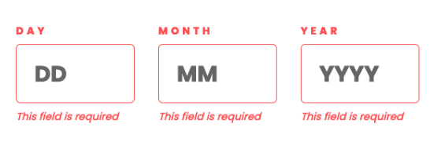
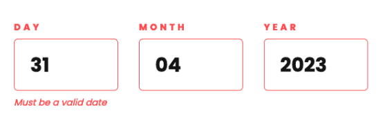
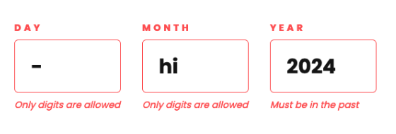
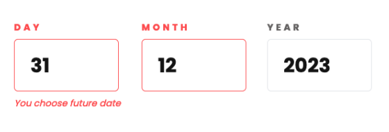

# Frontend Mentor - Age calculator app solution

This is a solution to the [Age calculator app challenge on Frontend Mentor](https://www.frontendmentor.io/challenges/age-calculator-app-dF9DFFpj-Q). Frontend Mentor challenges help you improve your coding skills by building realistic projects.

## Table of contents

- [Frontend Mentor - Age calculator app solution](#frontend-mentor---age-calculator-app-solution)
  - [Table of contents](#table-of-contents)
  - [Overview](#overview)
    - [The challenge](#the-challenge)
    - [Screenshot](#screenshot)
      - [Desktop](#desktop)
      - [Mobile](#mobile)
    - [Links](#links)
  - [My process](#my-process)
    - [Built with](#built-with)
    - [What I learned](#what-i-learned)
    - [Continued development](#continued-development)
    - [Useful resources](#useful-resources)
  - [Author](#author)

## Overview

### The challenge

Users should be able to:

- View an age in years, months, and days after submitting a valid date through the form
- Receive validation errors if:
  - Any field is empty when the form is submitted
  - The day number is not between 1-31
  - The month number is not between 1-12
  - The year is in the future
  - The date is invalid e.g. 31/04/1991 (there are 30 days in April)
- View the optimal layout for the interface depending on their device's screen size
- See hover and focus states for all interactive elements on the page

### Screenshot

  
Click here

#### Desktop

#### Mobile

### Links

- Solution URL: [GitHub Repo](https://github.com/lazzzaroni/age-calculator-app)
- Live Site URL: [GitHub Pages](https://lazzzaroni.github.io/age-calculator-app)

## My process

### Built with

- [React](https://reactjs.org/) - JS library
- [Next.js](https://nextjs.org/) - React framework
- [Tailwind CSS](https://tailwindcss.com/) - Styles
- [React-hook-form](https://tailwindcss.com/) + [Zod](https://zod.dev/) - Form validation

### What I learned

I thought that I could find solution for handling leap years in some library, but it turns out that pure JS solution looks simple and stable.

I handle almost all validation with Zod. It turns out that it was simpler than I thought.

Also I added validation for latest date in the year, f.e. if today is the 4th May of current year, you can't check the 5th May.

### Continued development

Studying `react-hook-form` and `zod`.

### Useful resources

- [Youtube: Typescript & Zod tutorial with React-Hook-Form](https://www.youtube.com/watch?v=JZjUv_qFtvM)

## Author

- Website - [mpaliakou.dev](https://mpaliakou.dev)
- Frontend Mentor - [@lazzzaroni](https://www.frontendmentor.io/profile/lazzzaroni)
